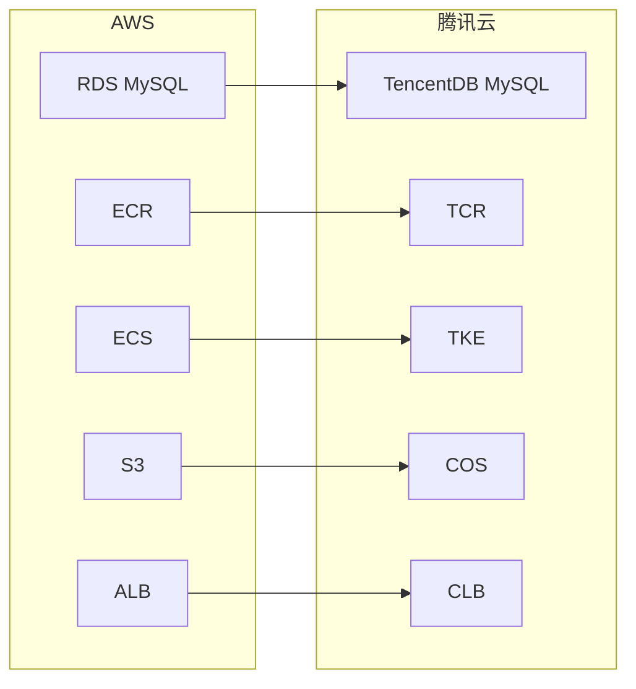

# 数据库改为 MySQL + 部署到腾讯云 需改动清单

## 一、数据库改为 MySQL

与 [DEPLOY-AWS-MYSQL.md](DEPLOY-AWS-MYSQL.md) 中「一、数据库改为 MySQL」**完全相同**，此处仅列要点，细节见该文档。

| 类别 | 涉及文件 / 内容 |
|------|------------------|
| 依赖 | [backend/requirements.txt](backend/requirements.txt)：`psycopg2-binary` → `PyMySQL` 或 `mysqlclient`，连接串用 `mysql+pymysql://...` 或 `mysql+mysqldb://...` |
| 配置 | [backend/.env.example](backend/.env.example)、[.env.example](.env.example)：`DATABASE_URL` 示例改为 MySQL |
| 迁移 | [backend/alembic.ini](backend/alembic.ini) 示例改为 MySQL；[backend/alembic/versions/](backend/alembic/versions/) 现有迁移一般无需改，注意 MySQL JSON 默认值兼容性 |
| 裸 SQL | [backend/app/main.py](backend/app/main.py)：`lifespan` 内 ALTER TABLE 的 JSON DEFAULT 需兼容 MySQL 8.0.13 以下或按 dialect 分支 |
| 测试 | [backend/tests/conftest.py](backend/tests/conftest.py)：可选支持从环境变量读 MySQL 测试 URL |
| 文档 | 各 docs 与 README 中 PostgreSQL 说明改为 MySQL |

---

## 二、部署到腾讯云

当前有 [backend/Dockerfile](backend/Dockerfile)，前端为 Next.js。部署到腾讯云时，用腾讯云对应产品替代 AWS 的 RDS/ECR/ECS/S3 等。

### 1. 架构与资源（需在腾讯云控制台配置）

| 用途 | 腾讯云产品 | 说明 |
|------|------------|------|
| 数据库 | **云数据库 MySQL（TencentDB for MySQL）** | 创建实例后获得内网/外网连接地址与端口（默认 3306）。生产建议同 VPC 内网连接；开发/测试可开外网地址。连接串格式：`mysql+pymysql://user:password@<内网或外网域名>:3306/edi_portal`。 |
| 后端运行 | **容器服务 TKE** 或 **云服务器 CVM** | **TKE**：镜像推送到 **容器镜像服务 TCR**（`ccr.ccs.tencentyun.com/<命名空间>/<镜像名>:tag`），在 TKE 中部署工作负载并暴露服务；或使用 **弹性集群** 类似 Fargate。**CVM**：直接装 Docker 拉取镜像或源码运行，适合单机/简单部署。 |
| 后端入口 | **负载均衡 CLB** 或 **API 网关** | TKE/CVM 上的后端服务通过 **CLB** 暴露 HTTPS；或通过 **API 网关** 转发到后端，便于限流、鉴权。 |
| 前端 | **云开发静态网站托管**、**COS + CDN** 或 **CVM** | **静态托管**：若 Next 可导出静态（`next export`），可用云开发静态托管 + `tcb hosting:deploy`。**SSR/需 Node 时**：用 **COS 放静态资源 + CDN**，或 **CVM** 上跑 `npm run start`。 |
| 文件存储 | **对象存储 COS** | 证书、规格书等当前在 [backend/app/services/storage.py](backend/app/services/storage.py) 写本地 `local_storage_path`。多实例/无状态时需改为 **COS** 读写，对应 AWS 的 S3。 |

### 2. 前端需改动

| 文件 / 位置 | 改动 |
|-------------|------|
| 构建与运行环境变量 | 设置 `NEXT_PUBLIC_API_BASE_URL` 为腾讯云上后端公网地址（如 CLB 或 API 网关的域名：`https://api.yourdomain.com`）。 |
| [next.config.mjs](next.config.mjs) | 当前 `rewrites` 指向 `http://127.0.0.1:8000`，仅适合本地。生产前后端分离时，前端直连 `NEXT_PUBLIC_API_BASE_URL`，应避免生产构建时代理到 127.0.0.1（可按环境变量区分或生产禁用 rewrites）。 |

### 3. 后端需改动

| 文件 / 位置 | 改动 |
|-------------|------|
| 运行环境变量 | 在 TKE 工作负载或 CVM 环境中配置：`DATABASE_URL`（TencentDB MySQL 内网或外网连接串）、`AUTH_SECRET`、`CORS_ORIGINS`（含前端域名，如云开发/ COS 分配域名）、`APP_ENV=production` 等。单实例时 `LOCAL_STORAGE_PATH` 可继续用挂载盘。 |
| [backend/app/core/config.py](backend/app/core/config.py) | 若接入 COS，在此增加 COS 相关配置（如 SecretId、SecretKey、Region、Bucket），从环境变量读取。 |
| [backend/Dockerfile](backend/Dockerfile) | 现有即可用于构建并推送到 TCR；按需可做多阶段或非 root 用户等优化。 |

### 4. 存储与文件访问（多实例/无状态时推荐）

| 文件 | 改动 |
|------|------|
| [backend/app/services/storage.py](backend/app/services/storage.py) | 抽象存储后端：本地目录 vs **腾讯云 COS**。根据配置选择实现；上传/下载改为 COS SDK（如 `cos-python-sdk-v5`），`file_path` 存 COS 的 Key 或完整路径。 |
| [backend/requirements.txt](backend/requirements.txt) | 若使用 COS：增加 `cos-python-sdk-v5`。 |
| [backend/app/routers/certificates.py](backend/app/routers/certificates.py)、[backend/app/routers/specifications.py](backend/app/routers/specifications.py) | 证书/规格书下载改为从 COS 取流并返回响应。 |

### 5. 腾讯云与 AWS 对照

### 6. 文档

| 文件 | 改动 |
|------|------|
| [docs/DEPLOYMENT.md](DEPLOYMENT.md) 等 | 增加「部署到腾讯云」小节：TencentDB MySQL 创建与连接、TCR 推送镜像与 TKE 部署（或 CVM 部署）、前端云开发/COS/CDN 或 CVM 配置、环境变量清单；若已接 COS，补充 COS Bucket 与权限说明。 |

---

## 三、建议执行顺序

1. **先完成 MySQL 迁移**：改依赖与 .env 示例 → 本地/CI 用 MySQL 跑迁移与 seed → 修 [backend/app/main.py](backend/app/main.py) 中 JSON DEFAULT 与 MySQL 的兼容性 → 文档更新。
2. **再部署腾讯云**：创建 TencentDB MySQL、TCR 仓库与 TKE 或 CVM、前端托管 → 配置 `DATABASE_URL`（TencentDB）、`NEXT_PUBLIC_API_BASE_URL`、`CORS_ORIGINS` 等 → 多实例时再接入 COS 并改 storage 与下载接口。

以上为腾讯云版本的完整改动清单，不包含具体补丁；与 AWS 版的差异仅在「二、部署」使用的云产品与连接方式不同，MySQL 部分与 AWS 版一致。
