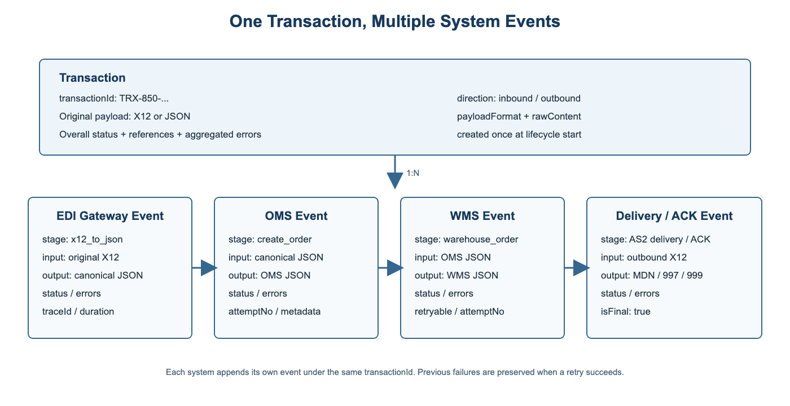
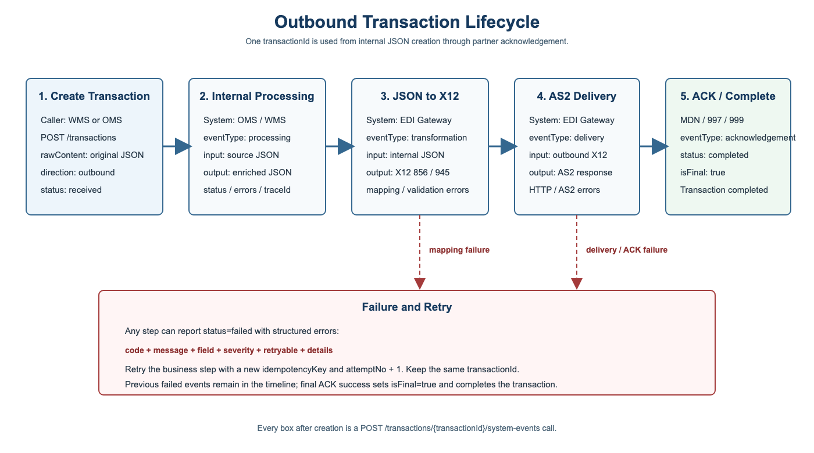

# Transaction Push API 对接文档

版本：v1
更新日期：2026-06-08

本文档面向 EDI Gateway、OMS、WMS、TMS 等系统，用于追踪一条原始业务数据在多个系统之间的完整生命周期。

## 1. 核心设计

平台采用：

```text
一条原始数据 = 一个 Transaction
一个系统处理步骤 = 一个 System Event
```

例如一条 Inbound 850：

```text
原始 X12 850
  → EDI Gateway 转换后的 Canonical JSON
  → OMS 创建订单后的 OMS JSON
  → WMS 创建仓库订单后的 WMS JSON
```

整个过程只使用一个 `transactionId`。EDI Gateway、OMS、WMS 分别向该 Transaction 追加自己的：

- 输入数据
- 输出数据
- 处理状态
- 处理阶段
- 错误信息
- 耗时与 traceId
- 重试次数

第一版仅提供单条接口，不提供批量任务和批量 Webhook。

## 2. 接口清单

| 接口 | 用途 | 调用场景 |
| --- | --- | --- |
| `POST /v1/integrations/transactions` | 创建原始交易 | 生命周期开始时调用一次 |
| `POST /v1/integrations/transactions/{transactionId}/system-events` | 上报某个系统的处理结果 | 每个系统、每个处理阶段完成或失败时调用 |
| `GET /v1/integrations/transactions/{transactionId}/system-events` | 查询系统处理事件 | 查询各系统的输入、输出、状态和错误 |
| `GET /v1/integrations/transactions/{transactionId}/timeline` | 查询完整生命周期 | 排查端到端链路或展示交易详情 |

## 3. 基础信息与认证

| 项目 | 地址 |
| --- | --- |
| 本地 Base URL | `http://localhost:8000` |
| 生产 Base URL | `http://81.70.150.216/api` |
| 本地 Swagger | `http://localhost:8000/docs` |

请求头：

```http
x-api-key: <API_KEY>
Content-Type: application/json
```

所有响应包含：

```http
x-trace-id: <TRACE_ID>
```

时间使用 ISO-8601，例如 `2026-06-08T10:00:00Z`。单次请求体上限为 5 MB。

## 4. 状态规范

Transaction 和 System Event 都使用以下标准状态：

| 状态 | 含义 |
| --- | --- |
| `received` | 已收到数据，尚未开始处理 |
| `processing` | 正在转换、校验、执行业务或发送 |
| `completed` | 当前步骤或整条链路成功完成 |
| `failed` | 当前步骤或整条链路失败 |

外部系统可以传自己的状态，例如 `ORDER_CREATED`、`REJECTED`。平台保存外部原状态，同时映射为标准状态。

根 Transaction 状态计算规则：

1. 任一新事件为 `failed`，根状态更新为 `failed`。
2. 非最终步骤成功后，根状态为 `processing`。
3. `isFinal=true` 的事件成功后，根状态为 `completed`。
4. 失败后允许用新的事件和新的幂等键重试；最终步骤成功后可恢复为 `completed`。

## 5. 创建原始 Transaction

### 5.1 使用场景

生命周期开始时调用一次：

- Inbound：EDI Gateway 收到 Trading Partner 的 X12 后创建。
- Outbound：OMS/WMS 产生准备发送给 Trading Partner 的原始 JSON 后创建。

后续系统不得重复创建新的 Transaction，应使用返回的 `transactionId` 上报 System Event。

### 5.2 接口

```http
POST /v1/integrations/transactions
```

### 5.3 请求字段

| 字段 | 类型 | 必填 | 说明 |
| --- | --- | --- | --- |
| `idempotencyKey` | string | 是 | 8-120 字符，原始交易幂等键 |
| `sourceSystem` | string | 是 | `edi`、`oms`、`wms`、`tms` |
| `environment` | string | 是 | `sandbox`、`production` |
| `partner` | string | 是 | Trading Partner 名称或代码 |
| `docType` | string | 是 | 如 `850`、`856`、`940`、`945`、`204`、`214` |
| `direction` | string | 是 | `inbound`、`outbound` |
| `status` | string | 是 | 原始外部状态 |
| `occurredAt` | datetime | 是 | 原始数据发生时间 |
| `businessRefs` | object | 否 | PO、订单、Shipment、Load 等引用 |
| `controlRefs` | object | 否 | ISA、GS、ST 控制号 |
| `externalEventId` | string | 否 | 来源系统事件 ID |
| `payloadFormat` | string | 是 | `x12`、`json`、`xml`、`text` |
| `rawContent` | string | 是 | 完整原始内容 |
| `rawPayload` | object | 否 | 来源系统、Sender、Receiver 等上下文 |

### 5.4 Inbound X12 示例

```bash
curl -X POST 'http://localhost:8000/v1/integrations/transactions' \
  -H 'Content-Type: application/json' \
  -H 'x-api-key: dev-integration-key' \
  --data-raw '{
    "idempotencyKey": "txn-inbound-850-20260608-0001",
    "sourceSystem": "edi",
    "environment": "sandbox",
    "partner": "Test0608-1",
    "docType": "850",
    "direction": "inbound",
    "status": "received",
    "occurredAt": "2026-06-08T10:00:00Z",
    "businessRefs": {"poNo": "PO-20260608-0001"},
    "controlRefs": {
      "isaControlNo": "000000001",
      "gsControlNo": "1",
      "stControlNo": "0001"
    },
    "externalEventId": "as2-message-0001",
    "payloadFormat": "x12",
    "rawContent": "ISA*00*...~GS*PO*...~ST*850*0001~BEG*00*SA*PO-20260608-0001**20260608~SE*3*0001~GE*1*1~IEA*1*000000001~",
    "rawPayload": {
      "senderId": "PARTNER",
      "receiverId": "UNIS",
      "channel": "AS2"
    }
  }'
```

### 5.5 Outbound JSON 示例

```json
{
  "idempotencyKey": "txn-outbound-856-20260608-0001",
  "sourceSystem": "wms",
  "environment": "production",
  "partner": "Partner-A",
  "docType": "856",
  "direction": "outbound",
  "status": "created",
  "occurredAt": "2026-06-08T11:00:00Z",
  "businessRefs": {
    "orderNo": "SO-1001",
    "shipmentNo": "SHP-2001"
  },
  "controlRefs": {},
  "externalEventId": "wms-shipment-2001",
  "payloadFormat": "json",
  "rawContent": "{\"shipmentNo\":\"SHP-2001\",\"status\":\"SHIPPED\"}",
  "rawPayload": {
    "senderId": "WMS",
    "receiverId": "EDI_GATEWAY"
  }
}
```

### 5.6 响应

```json
{
  "success": true,
  "data": {
    "success": true,
    "transactionId": "TRX-850-7ab4e9f1d2",
    "status": "received",
    "idempotent": false,
    "linking": {
      "linked": false,
      "relatedTransactionIds": []
    }
  }
}
```

## 6. 上报 System Event

### 6.1 使用场景

每个系统处理同一条数据后调用：

- EDI Gateway 完成 X12 解析或 JSON/X12 转换。
- OMS 完成订单校验、创建或更新。
- WMS 完成仓库订单、Shipment、Inventory 等业务处理。
- EDI Gateway 完成外发、收到 MDN 或 Functional ACK。
- 任一系统处理失败，需要上报结构化错误。

### 6.2 接口

```http
POST /v1/integrations/transactions/{transactionId}/system-events
```

### 6.3 请求字段

| 字段 | 类型 | 必填 | 说明 |
| --- | --- | --- | --- |
| `idempotencyKey` | string | 是 | 当前系统事件的幂等键 |
| `system` | string | 是 | 如 `edi-gateway`、`oms`、`wms` |
| `stage` | string | 是 | 如 `x12_to_json`、`create_order` |
| `eventType` | string | 是 | 见下表 |
| `status` | string | 是 | 当前系统外部状态 |
| `occurredAt` | datetime | 是 | 处理完成或失败时间 |
| `message` | string | 否 | 可读说明 |
| `inputFormat` | string | 否 | `x12`、`json`、`xml`、`text` |
| `inputData` | any | 否 | 当前系统实际收到的数据 |
| `outputFormat` | string | 否 | 输出格式 |
| `outputData` | any | 否 | 当前系统处理后输出的数据 |
| `errors` | array | 否 | 结构化错误数组 |
| `durationMs` | integer | 否 | 处理耗时 |
| `traceId` | string | 否 | 当前系统链路 ID |
| `attemptNo` | integer | 否 | 第几次尝试，默认 `1` |
| `isFinal` | boolean | 否 | 是否为整条生命周期最终步骤 |
| `metadata` | object | 否 | Service、版本、节点等扩展信息 |

`eventType`：

| 值 | 使用场景 |
| --- | --- |
| `received` | 系统确认收到数据 |
| `validation` | Schema 或业务校验 |
| `transformation` | X12/JSON/XML 格式转换 |
| `processing` | OMS/WMS/TMS 业务处理 |
| `delivery` | 向下游系统或 Trading Partner 发送 |
| `acknowledgement` | MDN、997、999 或业务 ACK |

### 6.4 EDI Gateway 转 JSON

```json
{
  "idempotencyKey": "event-edi-transform-0001",
  "system": "edi-gateway",
  "stage": "x12_to_canonical_json",
  "eventType": "transformation",
  "status": "completed",
  "occurredAt": "2026-06-08T10:00:01Z",
  "message": "X12 850 converted to canonical JSON",
  "inputFormat": "x12",
  "inputData": {
    "rawReference": "TRX-850-7ab4e9f1d2"
  },
  "outputFormat": "json",
  "outputData": {
    "poNo": "PO-20260608-0001",
    "lines": [{"sku": "SKU-1", "qty": 2}]
  },
  "errors": [],
  "durationMs": 42,
  "traceId": "edi-trace-001",
  "attemptNo": 1,
  "isFinal": false,
  "metadata": {
    "mappingVersion": "850-v1"
  }
}
```

### 6.5 OMS 处理成功

```json
{
  "idempotencyKey": "event-oms-create-0001",
  "system": "oms",
  "stage": "create_sales_order",
  "eventType": "processing",
  "status": "ORDER_CREATED",
  "occurredAt": "2026-06-08T10:00:02Z",
  "inputFormat": "json",
  "inputData": {
    "poNo": "PO-20260608-0001",
    "lines": [{"sku": "SKU-1", "qty": 2}]
  },
  "outputFormat": "json",
  "outputData": {
    "orderNo": "SO-1001",
    "status": "CREATED"
  },
  "errors": [],
  "durationMs": 180,
  "traceId": "oms-trace-001",
  "attemptNo": 1,
  "isFinal": false,
  "metadata": {
    "service": "oms-order-service"
  }
}
```

### 6.6 WMS 处理失败

```json
{
  "idempotencyKey": "event-wms-create-0001",
  "system": "wms",
  "stage": "create_warehouse_order",
  "eventType": "processing",
  "status": "failed",
  "occurredAt": "2026-06-08T10:00:03Z",
  "message": "Warehouse order creation failed",
  "inputFormat": "json",
  "inputData": {
    "orderNo": "SO-1001",
    "warehouseOrderNo": ""
  },
  "outputFormat": "json",
  "outputData": {
    "accepted": false
  },
  "errors": [
    {
      "code": "WMS_REQUIRED_FIELD",
      "message": "warehouseOrderNo is required",
      "field": "warehouseOrderNo",
      "severity": "error",
      "retryable": true,
      "details": {
        "source": "WMS"
      }
    }
  ],
  "durationMs": 95,
  "traceId": "wms-trace-001",
  "attemptNo": 1,
  "isFinal": false,
  "metadata": {
    "service": "wms-order-service"
  }
}
```

### 6.7 System Event 响应

```json
{
  "success": true,
  "data": {
    "transactionId": "TRX-850-7ab4e9f1d2",
    "transactionStatus": "failed",
    "idempotent": false,
    "event": {
      "eventId": "TSE-a102b94f64344e8cb209",
      "system": "wms",
      "stage": "create_warehouse_order",
      "status": "failed",
      "errors": [
        {
          "code": "WMS_REQUIRED_FIELD",
          "message": "warehouseOrderNo is required",
          "retryable": true
        }
      ]
    }
  }
}
```

## 7. 查询 System Events

### 7.1 接口

```http
GET /v1/integrations/transactions/{transactionId}/system-events
```

### 7.2 使用场景

- 查看每个系统处理到哪一步。
- 对比 OMS 输入与输出、WMS 输入与输出。
- 查看失败系统、失败字段和重试次数。
- 构建系统处理历史列表。

### 7.3 响应结构

```json
{
  "success": true,
  "data": {
    "transactionId": "TRX-850-7ab4e9f1d2",
    "transactionStatus": "processing",
    "eventCount": 2,
    "events": [
      {
        "eventId": "TSE-001",
        "system": "edi-gateway",
        "stage": "x12_to_canonical_json",
        "eventType": "transformation",
        "status": "completed",
        "input": {"format": "x12", "data": {}},
        "output": {"format": "json", "data": {"poNo": "PO-1"}},
        "errors": [],
        "attemptNo": 1
      }
    ]
  }
}
```

## 8. 查询完整 Timeline

### 8.1 接口

```http
GET /v1/integrations/transactions/{transactionId}/timeline
```

### 8.2 使用场景

- 交易详情页一次展示原始数据和全部系统事件。
- 排查一条数据在哪个系统失败。
- 对比 X12、Canonical JSON、OMS JSON、WMS JSON。
- 查看整条链路的错误汇总。

返回内容：

```text
transaction
  ├─ rawContent：最初的 X12 或 JSON
  ├─ rawPayload：原始上下文
  ├─ status：总体状态
  ├─ businessRefs / controlRefs
  └─ errors：全链路错误汇总

events[]
  ├─ 每个系统的 input
  ├─ 每个系统的 output
  ├─ status / errors
  ├─ durationMs / traceId
  └─ attemptNo / isFinal
```

## 9. 数据结构图



关系说明：

```text
transactions 1 ─── N transaction_system_events

transactions
  保存唯一原始数据、当前总体状态、业务引用、控制号和错误汇总

transaction_system_events
  保存每个系统每个阶段的输入、输出、状态、错误、耗时和重试信息
```

## 10. Inbound 生命周期

Inbound 示例：Trading Partner 发送 X12 850，内部转换为 JSON 后进入 OMS 和 WMS。

| 顺序 | 调用方 | 接口 | 记录内容 | 根状态 |
| --- | --- | --- | --- | --- |
| 1 | EDI Gateway | `POST /transactions` | 完整 X12 850 | `received` |
| 2 | EDI Gateway | `POST /{id}/system-events` | X12 → Canonical JSON | `processing` |
| 3 | OMS | `POST /{id}/system-events` | OMS 输入、订单创建结果 | `processing` |
| 4 | WMS | `POST /{id}/system-events` | WMS 输入、仓库订单结果 | `completed` 或 `failed` |
| 5 | 任意查询方 | `GET /{id}/timeline` | 原文 + 全部系统反馈 | 不变 |

最后一个必要步骤成功时传：

```json
{
  "status": "completed",
  "isFinal": true
}
```

## 11. Outbound 生命周期

Outbound 示例：WMS 产生 Shipment JSON，经 OMS/EDI Gateway 转换为 X12 856 后发给 Trading Partner。



| 顺序 | 调用方 | 接口 | 记录内容 | 根状态 |
| --- | --- | --- | --- | --- |
| 1 | WMS | `POST /transactions` | 原始 Shipment JSON | `received` |
| 2 | OMS | `POST /{id}/system-events` | OMS 校验或补充后的 JSON | `processing` |
| 3 | EDI Gateway | `POST /{id}/system-events` | JSON → X12 856 | `processing` |
| 4 | EDI Gateway | `POST /{id}/system-events` | AS2 Delivery 结果 | `processing` |
| 5 | EDI Gateway | `POST /{id}/system-events` | MDN/997/999 ACK | `completed` 或 `failed` |

最终 ACK 成功事件设置 `isFinal=true`。

## 12. 接口调用日志说明

平台保存两类日志：

### 12.1 API 调用日志

每次 HTTP 请求自动写入 `api_call_logs`：

| 字段 | 说明 |
| --- | --- |
| `trace_id` | 响应头 `x-trace-id` |
| `client_id` | API Key 对应客户端 |
| `method` / `path` | 调用接口 |
| `status_code` | HTTP 状态 |
| `latency_ms` | 接口耗时 |
| `created_at` | 调用时间 |

它用于排查“接口是否调用成功”，不保存业务输入输出。

### 12.2 System Event 业务日志

System Event 用于排查“数据在系统内部处理成什么结果”：

```text
10:00:00 EDI  received        原始 X12 已保存
10:00:01 EDI  transformation  X12 → JSON completed
10:00:02 OMS  processing      create_sales_order completed
10:00:03 WMS  validation      create_warehouse_order failed
10:01:10 WMS  validation      retry attempt 2 completed
```

推荐所有系统同时保存平台 `transactionId` 和自己的 `traceId`，这样可以双向检索。

## 13. 错误处理与重试

### 13.1 错误结构

| 字段 | 必填 | 说明 |
| --- | --- | --- |
| `code` | 是 | 稳定、可检索的错误代码 |
| `message` | 是 | 可读错误说明 |
| `field` | 否 | 出错字段或 JSON Path |
| `severity` | 否 | `warning`、`error`、`fatal` |
| `retryable` | 否 | 修正数据或系统恢复后是否可重试 |
| `details` | 否 | 原系统错误码、期望值等扩展信息 |

### 13.2 HTTP 错误与业务错误

- HTTP `4xx/5xx`：本次接口调用失败，System Event 未成功保存。
- HTTP `200` + Event `status=failed`：接口调用成功，但业务处理失败，错误已保存。

调用方必须区分这两种情况。

### 13.3 重试规则

1. 同一次上报因网络超时重试：复用原 `idempotencyKey`。
2. 系统重新执行业务处理：使用新的 `idempotencyKey`，并增加 `attemptNo`。
3. 原失败事件不覆盖，平台保留失败和后续成功事件。
4. 可重试错误恢复后，最后必要步骤成功并传 `isFinal=true`，根 Transaction 可恢复为 `completed`。

重试示例：

```json
{
  "idempotencyKey": "event-wms-create-0002",
  "system": "wms",
  "stage": "create_warehouse_order",
  "eventType": "processing",
  "status": "completed",
  "occurredAt": "2026-06-08T10:01:10Z",
  "inputFormat": "json",
  "inputData": {
    "warehouseOrderNo": "WO-1001"
  },
  "outputFormat": "json",
  "outputData": {
    "accepted": true
  },
  "errors": [],
  "attemptNo": 2,
  "isFinal": true
}
```

## 14. 幂等规则

- Transaction：按 `idempotencyKey` 去重。
- Transaction 次级去重：`sourceSystem + externalEventId`。
- System Event：按 `transactionId + idempotencyKey` 去重。
- 重复请求返回已有记录，并返回 `idempotent=true`。

## 15. 交易自动关联

不同原始交易之间仍可根据业务引用建立关系：

| 单据关系 | 推荐关联字段 |
| --- | --- |
| `850` → `856` | `poNo` |
| `940` → `945` | `warehouseOrderNo` |
| `204` → `214` | `loadNo` |

注意：这是不同 Transaction 之间的业务关联；同一条原始数据在 OMS/WMS 中的处理过程使用 System Event，不要创建多个 Transaction。

## 16. HTTP 状态码

| HTTP 状态 | 说明 |
| --- | --- |
| `200` | 请求成功，继续检查 `data.status` |
| `401` | API Key 缺失或无效 |
| `403` | 权限或来源 IP 不允许 |
| `413` | 请求体超过 5 MB |
| `422` | 字段缺失、类型或枚举不合法 |
| `429` | 频率或配额超限 |
| `500` | 平台内部异常 |

业务错误码：

| 错误码 | 说明 |
| --- | --- |
| `TRX_NOT_FOUND` | `transactionId` 不存在 |

## 17. 对接要求

1. 所有系统必须保存并传递同一个 `transactionId`。
2. 每个系统必须上报自己的输入、输出、状态和错误，不只上报成功/失败。
3. `inputData` 和 `outputData` 应保存当时真实使用的数据，不应只传摘要。
4. 密码、Token、证书私钥等敏感信息不得放入 input/output。
5. 错误代码应稳定，错误 message 可以更详细。
6. 最终系统负责设置 `isFinal=true`。
7. 调用方必须保存 `x-trace-id`，并在 System Event 中传自己的 `traceId`。
